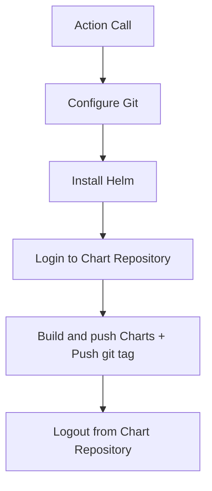

# helm-chart-releaser-action

This repository provides a GitHub action for publishing Helm charts to an OCI-compatible registry. Before publishing the charts, the action also creates a Git tag for the current commit. The tag is named after the name and version of the chart. If the chart template contains changes, but the Chart.yaml version key is not updated, the action skips publishing and takes no action. On the other hand, if the Chart.yaml version key is updated, the action creates a Git tag and pushes it to the repository.

Example:

Assuming the chart's name is 'test-chart' and the version is '0.1.0', the action will create a git tag named 'test-chart-0.1.0'.

## Input values

| Input | Required | Default | Description |
| --- | --- | --- | --- |
| `gh_token` | `true` | | GitHub token to use for authentication. |
| `github_actor` | `false` | `${{ github.actor }}` | GitHub actor to use for git operations (git tag). |
| `charts_dir` | `false` | `charts` | Directory containing the Helm Charts. |
| `chart_repository_url` | `true` | The URL of the chart repository to release the charts to. This is used to configure the Helm push plugin. Example: `oci://ghcr.io/username/repo`. |
| `chart_repository_username` | `true` | | The username to use when authenticating to the chart repository. This is used to configure the Helm push plugin. |
| `chart_repository_password` | `true` | The password to use when authenticating to the chart repository. This is used to configure the Helm push plugin. |

### Environment variables

| Variable | Required | Default | Description |
| --- | --- | --- | --- |
| `DEBUG` | `false` | `false` | Enable debug output. |

## Flow of the action



## Example usage

```yaml
name: Release Charts

on:
  push:
    branches:
      - main

jobs:
  release:
    runs-on: ubuntu-latest
    steps:
      - name: Checkout
        uses: actions/checkout@v3
        with:
          fetch-depth: 0
      - name: Run chart-releaser
        uses: urbanmedia/helm-chart-releaser-action@v1.0.0
        with:
          gh_token: ${{ secrets.GITHUB_TOKEN }}
          chart_repository_url: oci://ghcr.io/urbanmedia/helm-charts
          chart_repository_username: ${{ secrets.GHCR_USERNAME }}
          chart_repository_password: ${{ secrets.GHCR_PASSWORD }}
```

## Known limitations

- Updating existing Helm charts with the same version is not supported. Any attempt to do so will result in an error.</br>
  `Error: unexpected status from HEAD request to https://<registry-url>/v2/<repository>/<chart-name>/manifests/<version>: 412 Precondition Failed`

## Running tests locally

In order to run the tests locally, you need to have [docker](https://www.docker.com/) installed. Docker is used to run a local OCI compatible registry. The tests will push a Helm chart to the local registry. You can then verify with `docker pull` that the chart was pushed successfully.

**Start the local registry:**

```bash
cd _tests
docker-compose up -d
```

**Run the tests:**

```bash
DEBUG="true" CHARTS_DIR="_tests/charts" CHART_REPOSITORY="oci://localhost:5000/test/helm-charts" ./entrypoint.sh
```

**Verify that the chart was pushed:**

```bash
docker pull localhost:5000/test/helm-charts:chart-0.1.0
```

Expected output:

```bash
0.1.0: Pulling from test/helm-charts/test-chart
unsupported media type application/vnd.cncf.helm.config.v1+json
```

If you see the above output, the chart was pushed successfully.

**Stop the local registry:**

```bash
cd _tests
docker-compose down
```
