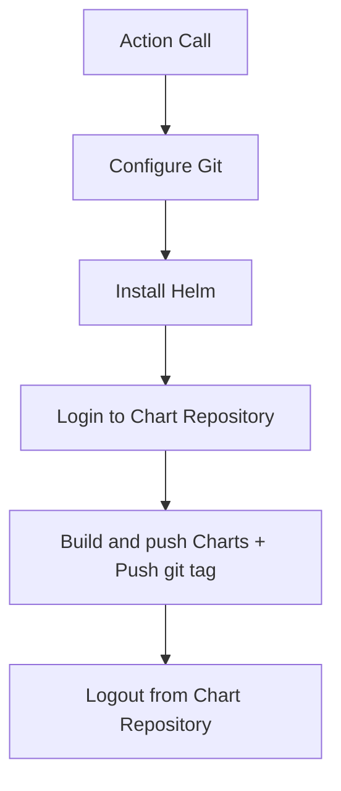

# helm-chart-releaser-action

This repository provides a GitHub action for publishing Helm charts to a chart repository using the ***push*** command provided by Helm.

## Input values

| Input | Required | Default | Description |
| --- | --- | --- | --- |
| `gh_token` | `true` | | GitHub token to use for authentication. |
| `github_actor` | `false` | `${{ github.actor }}` | GitHub actor to use for git operations (git tag). |
| `charts_dir` | `false` | `charts` | Directory containing the Helm Charts. |
| `chart_repository_url` | `true` | The URL of the chart repository to release the charts to. This is used to configure the Helm push plugin. Example: `oci://ghcr.io/username/repo`. |
| `chart_repository_username` | `true` | | The username to use when authenticating to the chart repository. This is used to configure the Helm push plugin. |
| `chart_repository_password` | `true` | The password to use when authenticating to the chart repository. This is used to configure the Helm push plugin. |

### Environment variables

| Variable | Required | Default | Description |
| --- | --- | --- | --- |
| `DEBUG` | `false` | `false` | Enable debug output. |

## Flow of the action



## Example usage

```yaml
name: Release Charts

on:
  push:
    branches:
      - main

jobs:
  release:
    runs-on: ubuntu-latest
    steps:
      - name: Checkout
        uses: actions/checkout@v3
        with:
          fetch-depth: 0
      - name: Run chart-releaser
        uses: urbanmedia/helm-chart-releaser-action@latest
        with:
          gh_token: ${{ secrets.GITHUB_TOKEN }}
          chart_repository_url: oci://ghcr.io/urbanmedia/helm-charts
          chart_repository_username: ${{ secrets.GHCR_USERNAME }}
          chart_repository_password: ${{ secrets.GHCR_PASSWORD }}
```

## Known limitations

- Updating existing Helm charts with the same version is not supported. Any attempt to do so will result in an error.</br>
  `Error: unexpected status from HEAD request to https://<registry-url>/v2/<repository>/<chart-name>/manifests/<version>: 412 Precondition Failed`
